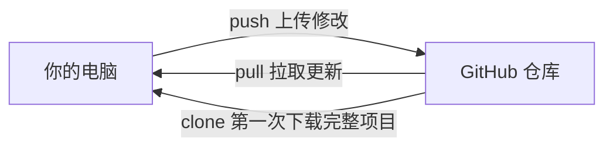
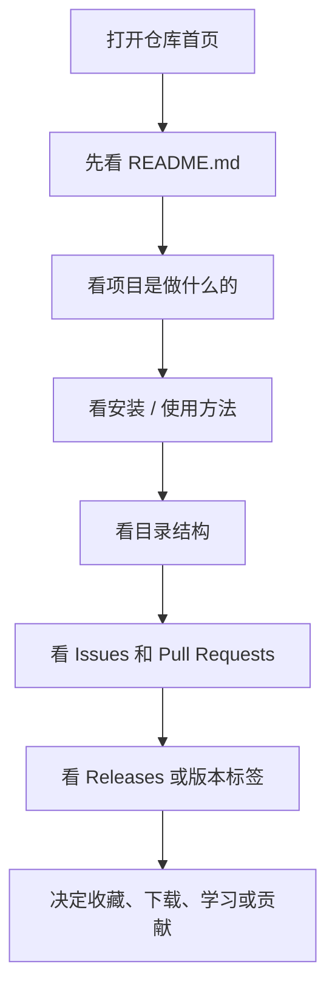
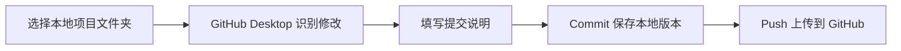
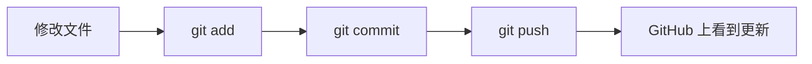
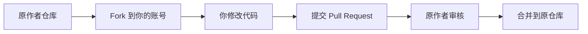
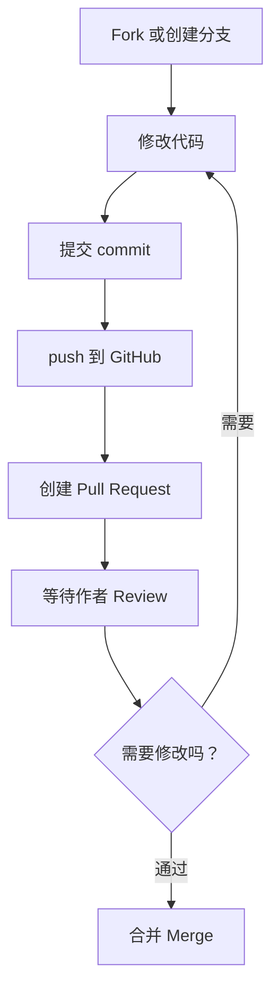
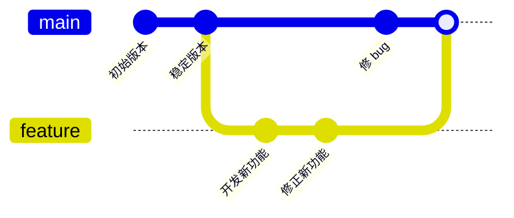
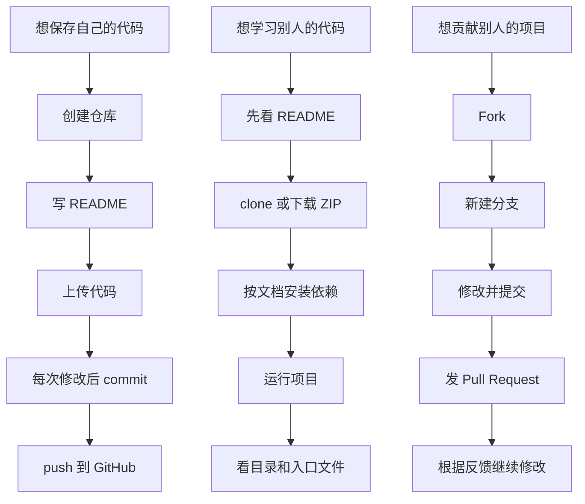

# GitHub 纯小白使用指南

> 适合对象：从没用过 GitHub，或只听说过“代码库、下载代码、提交代码”的新手。
>
> 阅读目标：看完后你能知道 GitHub 能干什么、怎样创建自己的代码库、怎样看懂别人的项目、怎样下载和运行代码、怎样参与别人的项目。
>
> 更新时间：2026-07-03

---

## 1. 先明确：GitHub 能干什么？

一句话：**GitHub 是一个用来保存代码、管理版本、协作开发、学习开源项目的平台。**

你可以把它理解成“程序员的网盘 + 项目管理工具 + 协作平台 + 作品集”。

### 1.1 GitHub 最常见的用途

| 你想做什么 | GitHub 能怎么帮你 |
|---|---|
| 保存自己的代码 | 把项目上传到 GitHub，不怕电脑坏了丢代码 |
| 记录每次修改 | 每次保存一个“版本快照”，以后可以查历史、回退 |
| 展示作品 | 面试、接单、学习记录都可以把仓库链接发给别人 |
| 和别人合作 | 多个人可以同时开发一个项目，互相审查修改 |
| 学习别人的代码 | 搜索优秀项目，阅读源码、文档、提交记录 |
| 下载开源项目 | 下载到电脑本地运行、学习、二次开发 |
| 反馈问题 | 在 Issues 里向作者提 bug、问问题、提建议 |
| 贡献代码 | Fork 项目，修改后通过 Pull Request 提交给作者 |
| 自动化构建/测试 | 用 GitHub Actions 自动运行测试、打包、部署 |
| 发布版本 | 用 Releases 发布软件安装包、压缩包、版本说明 |

### 1.2 GitHub 和 Git 是什么关系？

很多新手会混淆：

| 名称 | 通俗理解 |
|---|---|
| Git | 安装在电脑上的“版本管理工具” |
| GitHub | 互联网上托管 Git 仓库的网站 |
| 仓库 Repository / Repo | 一个项目的文件夹，里面有代码、文档、历史记录 |
| 提交 Commit | 一次保存好的修改记录 |
| 分支 Branch | 一条独立的修改路线 |
| 克隆 Clone | 把 GitHub 上的仓库完整复制到你的电脑 |
| 推送 Push | 把你电脑上的修改上传到 GitHub |
| 拉取 Pull | 把 GitHub 上的新修改同步到你的电脑 |

可以这样理解：



---

## 2. 新手先认识 GitHub 页面

打开一个 GitHub 项目后，你通常会看到这些区域：

| 页面位置 | 你应该看什么 |
|---|---|
| Code | 项目文件、下载按钮、克隆地址 |
| README.md | 项目说明书，通常是最重要的入口 |
| Issues | 问题、bug、需求、讨论 |
| Pull requests | 别人提交的代码修改请求 |
| Actions | 自动测试、自动构建、自动部署记录 |
| Projects | 项目看板和任务管理 |
| Wiki | 更详细的项目文档 |
| Releases | 已发布版本、安装包、压缩包 |
| Branches | 分支列表 |
| Commits | 历史提交记录 |
| Stars | 收藏数，常被用来粗略判断项目受欢迎程度 |
| Forks | 被复制出去继续开发的次数 |

### 2.1 看一个仓库的推荐顺序



---

## 3. 使用 GitHub 前要准备什么？

### 3.1 必备账号

1. 打开 [GitHub 官网](https://github.com/)。
2. 注册账号。
3. 验证邮箱。
4. 设置头像、昵称、个人简介。

### 3.2 推荐安装的软件

| 软件 | 用途 | 新手建议 |
|---|---|---|
| Git | 在电脑上管理代码版本 | 必装 |
| VS Code | 写代码、看代码 | 强烈推荐 |
| GitHub Desktop | 图形化使用 GitHub | 不想记命令的新手推荐 |
| Node.js / Python / Java 等 | 运行具体项目 | 按项目 README 要求安装 |

下载地址：

- Git：[https://git-scm.com/](https://git-scm.com/)
- VS Code：[https://code.visualstudio.com/](https://code.visualstudio.com/)
- GitHub Desktop：[https://desktop.github.com/](https://desktop.github.com/)

### 3.3 新手应该选命令行还是 GitHub Desktop？

| 方式 | 适合谁 | 优点 | 缺点 |
|---|---|---|---|
| GitHub 网页 | 只想上传少量文件、改 README | 最简单 | 不适合复杂开发 |
| GitHub Desktop | 怕命令行的新手 | 图形化，容易理解 | 高级操作较少 |
| Git 命令行 | 想认真学开发的人 | 最通用、最强 | 前期需要记命令 |

建议路线：

1. 第 1 天：先用 GitHub 网页创建仓库。
2. 第 2-3 天：用 GitHub Desktop 学会上传、下载、提交。
3. 第 4 天以后：逐步学习常用 Git 命令。

---

## 4. 创建自己的第一个代码库

这里先讲最适合小白的网页方式。

### 4.1 创建新仓库

1. 登录 GitHub。
2. 点击右上角的 `+`。
3. 选择 `New repository`。
4. 填写仓库名称，例如：`my-first-project`。
5. 填写描述，例如：`我的第一个 GitHub 项目`。
6. 选择可见性：
   - `Public`：公开，别人能看到。
   - `Private`：私有，只有你和被邀请的人能看到。
7. 勾选 `Add a README file`。
8. 需要的话选择 `.gitignore` 和 License。
9. 点击 `Create repository`。

### 4.2 仓库名称怎么取？

推荐：

- 用英文小写。
- 单词之间用短横线，例如：`todo-app`、`python-study-notes`。
- 名称能看出项目用途。

不推荐：

- `test`
- `111`
- `新建文件夹`
- `my project final final v2`

### 4.3 README 是什么？

`README.md` 是项目说明书。别人打开你的仓库，最先看到的通常就是它。

一个合格的 README 至少应该写：

```markdown
# 项目名称

这个项目是做什么的。

## 功能

- 功能 1
- 功能 2

## 如何运行

1. 安装依赖
2. 启动项目

## 使用示例

这里写怎么使用。
```

### 4.4 .gitignore 是什么？

`.gitignore` 是“不上传清单”。

有些文件不应该上传到 GitHub，比如：

- 密码、密钥、Token
- 临时文件
- 缓存文件
- 编译产物
- 本地依赖目录，例如 `node_modules`

常见例子：

```gitignore
node_modules/
.env
dist/
__pycache__/
.DS_Store
```

### 4.5 License 是什么？

License 是“别人能不能用你的代码、怎么用”的规则。

常见选择：

| License | 大概意思 |
|---|---|
| MIT | 很宽松，别人基本可以自由使用，但要保留版权说明 |
| Apache-2.0 | 宽松，同时更明确涉及专利授权 |
| GPL | 如果别人基于你的代码发布，也要开源 |
| 不写 License | 默认别人没有明确授权，通常不能随便用 |

新手如果只是学习项目，可以先不纠结。准备正式公开给别人使用时，再认真选择。

---

## 5. 往自己的仓库上传代码

你有三种常用方式。

### 5.1 方法一：直接在网页上传

适合：少量文件、学习演示。

步骤：

1. 打开自己的仓库。
2. 点击 `Add file`。
3. 选择 `Upload files`。
4. 拖入文件。
5. 写提交说明，例如：`Add project files`。
6. 点击 `Commit changes`。

缺点：文件多、项目复杂时不方便。

### 5.2 方法二：用 GitHub Desktop

适合：不想记命令的新手。

基本流程：



操作思路：

1. 打开 GitHub Desktop。
2. 登录 GitHub 账号。
3. 选择 `File` -> `Add local repository`。
4. 选择你的项目文件夹。
5. 如果还不是 Git 仓库，按提示创建。
6. 填写 Summary，例如：`Initial commit`。
7. 点击 `Commit to main`。
8. 点击 `Publish repository` 或 `Push origin`。

### 5.3 方法三：用 Git 命令

适合：想认真学开发的人。

如果你电脑里已有一个项目文件夹：

```bash
git init
git add .
git commit -m "Initial commit"
git branch -M main
git remote add origin https://github.com/你的用户名/你的仓库名.git
git push -u origin main
```

每次修改代码后的常用流程：

```bash
git status
git add .
git commit -m "说明这次改了什么"
git push
```

记住这个口诀：

> 改文件 -> add 暂存 -> commit 保存版本 -> push 上传



---

## 6. 学会看别人的代码

很多人打开开源项目会懵：文件好多，不知道从哪看。

正确方法不是从第一个文件硬读到最后一个文件，而是按线索读。

### 6.1 第一步：先看 README

README 里通常有：

- 项目简介
- 功能截图
- 安装方法
- 运行命令
- 使用示例
- 技术栈
- 贡献方式

先回答三个问题：

1. 这个项目解决什么问题？
2. 我怎样把它跑起来？
3. 它的核心功能在哪里？

### 6.2 第二步：看目录结构

常见目录含义：

| 文件 / 文件夹 | 常见含义 |
|---|---|
| `README.md` | 项目说明 |
| `docs/` | 文档 |
| `src/` | 源代码 |
| `test/` 或 `tests/` | 测试代码 |
| `examples/` | 示例 |
| `public/` | 前端静态资源 |
| `package.json` | Node.js 项目信息和脚本 |
| `requirements.txt` | Python 依赖 |
| `pyproject.toml` | Python 项目配置 |
| `pom.xml` | Java Maven 项目配置 |
| `build.gradle` | Java / Android Gradle 配置 |
| `Dockerfile` | Docker 构建说明 |
| `.github/workflows/` | GitHub Actions 自动化流程 |

### 6.3 第三步：找入口文件

不同项目入口不一样：

| 项目类型 | 常见入口 |
|---|---|
| 前端项目 | `package.json` 里的 `scripts`，以及 `src/main.*`、`src/App.*` |
| Node.js 后端 | `server.js`、`app.js`、`index.js` |
| Python 脚本 | `main.py`、`app.py` |
| Python 包 | `pyproject.toml`、`setup.py`、包目录 |
| Java | `src/main/java` 下的 `Main` 或启动类 |
| Go | `main.go` |

### 6.4 第四步：看运行脚本

如果是 Node.js 项目，重点看 `package.json`：

```json
{
  "scripts": {
    "dev": "vite",
    "build": "vite build",
    "test": "vitest"
  }
}
```

这说明：

- `npm run dev`：启动开发环境
- `npm run build`：打包
- `npm test` 或 `npm run test`：运行测试

如果是 Python 项目，常见命令可能是：

```bash
pip install -r requirements.txt
python main.py
```

### 6.5 第五步：看提交记录

点击仓库里的 `Commits`，可以看到作者每次改了什么。

适合用来理解：

- 这个功能是怎么一步步做出来的
- 某个 bug 是怎么修的
- 最近项目是否还活跃

### 6.6 第六步：看 Issues 和 Pull Requests

| 区域 | 能学到什么 |
|---|---|
| Issues | 用户遇到的问题、项目计划、常见 bug |
| Pull Requests | 代码是怎样被修改、审查、合并的 |

如果你想参与项目，可以找这些标签：

- `good first issue`
- `help wanted`
- `documentation`
- `bug`

---

## 7. 如何下载别人的代码并使用？

有两种主流方式：下载 ZIP 和 Clone。

### 7.1 下载 ZIP

适合：只想看看代码，不打算跟踪更新。

步骤：

1. 打开仓库。
2. 点击绿色 `Code` 按钮。
3. 点击 `Download ZIP`。
4. 解压到本地。
5. 根据 README 运行。

优点：简单。

缺点：不是 Git 仓库，不方便同步作者后续更新。

### 7.2 Clone 克隆仓库

适合：想长期学习、运行、修改项目。

步骤：

1. 打开仓库。
2. 点击绿色 `Code` 按钮。
3. 复制 HTTPS 地址，例如：

```text
https://github.com/owner/project.git
```

4. 在电脑目标文件夹运行：

```bash
git clone https://github.com/owner/project.git
```

5. 进入项目：

```bash
cd project
```

以后作者更新了，你可以运行：

```bash
git pull
```

### 7.3 下载 ZIP 和 Clone 的区别

| 方式 | 能否同步更新 | 是否保留 Git 历史 | 适合场景 |
|---|---:|---:|---|
| Download ZIP | 否 | 否 | 临时查看、一次性下载 |
| git clone | 是 | 是 | 学习、开发、长期使用 |

### 7.4 下载后怎么运行？

一定先看 README。不同语言运行方式不同。

#### Node.js / 前端项目常见流程

```bash
npm install
npm run dev
```

或者：

```bash
pnpm install
pnpm dev
```

#### Python 项目常见流程

```bash
pip install -r requirements.txt
python main.py
```

#### Java Maven 项目常见流程

```bash
mvn install
mvn spring-boot:run
```

#### Docker 项目常见流程

```bash
docker build -t project-name .
docker run project-name
```

### 7.5 运行失败怎么办？

按这个顺序排查：

1. README 有没有写支持的系统、语言版本？
2. 依赖是否安装完整？
3. 命令是否在项目根目录运行？
4. 报错里有没有缺少文件、端口占用、权限不足？
5. Issues 里有没有别人遇到同样问题？
6. 项目最近是否还在维护？

提问时不要只说“跑不了”，要带上：

- 你的系统：Windows / macOS / Linux
- 语言版本：例如 Node.js 20、Python 3.12
- 你执行的命令
- 完整报错截图或文字
- 你已经尝试过什么

---

## 8. Fork、Star、Watch 分别是什么？

| 功能 | 通俗解释 | 什么时候用 |
|---|---|---|
| Star | 收藏 / 点赞 | 觉得项目有用，想以后再看 |
| Watch | 订阅通知 | 想收到项目动态 |
| Fork | 复制一份到自己账号 | 想修改别人的项目，或基于它做自己的版本 |

### 8.1 Fork 的使用场景

当你没有权限直接修改别人的仓库时，可以：



### 8.2 Fork 后怎样同步原项目更新？

在你的 Fork 仓库页面，GitHub 通常会显示是否落后于原仓库。你可以点击 `Sync fork` 来同步。

如果用命令行，常见流程是：

```bash
git remote -v
git remote add upstream https://github.com/原作者/原仓库.git
git fetch upstream
git checkout main
git merge upstream/main
git push
```

---

## 9. Pull Request 是什么？

Pull Request，常简称 PR。

通俗理解：**我改了一些代码，请你看看能不能合并到正式项目里。**

PR 通常包含：

- 改了哪些文件
- 为什么要改
- 解决了哪个问题
- 测试是否通过
- 讨论和代码审查

### 9.1 PR 的基本流程



### 9.2 一个好的 PR 应该怎么写？

建议包含：

```markdown
## 改动内容

- 修复了 xxx 问题
- 增加了 xxx 功能

## 为什么这样改

说明原因。

## 如何测试

1. 执行 xxx
2. 打开 xxx
3. 确认 xxx 正常
```

### 9.3 新手贡献开源的建议

先从低风险任务开始：

- 修 typo
- 改 README
- 补充文档
- 增加示例
- 修复简单 bug
- 给 Issue 提供复现步骤

不要一上来就大改架构。维护者更容易接受小而清晰的贡献。

---

## 10. 分支 Branch 是什么？

分支就是“独立工作区”。

比如正式版本在 `main` 分支，你想开发新功能，就新建一个分支：

```bash
git checkout -b add-login-page
```

这样你在新分支里修改，不会直接影响 `main`。



### 10.1 常见分支命名

| 类型 | 示例 |
|---|---|
| 新功能 | `feature/login` |
| 修 bug | `fix/login-error` |
| 文档 | `docs/update-readme` |
| 实验 | `experiment/new-ui` |

---

## 11. Commit 提交怎么写才清楚？

Commit message 是给未来的自己和队友看的。

差的写法：

- `update`
- `fix`
- `111`
- `改了点东西`

好的写法：

- `Add login page`
- `Fix user avatar upload error`
- `Update README installation steps`
- `Remove unused helper function`

常用格式：

```text
动词 + 做了什么
```

常用动词：

| 动词 | 含义 |
|---|---|
| Add | 新增 |
| Fix | 修复 |
| Update | 更新 |
| Remove | 删除 |
| Refactor | 重构 |
| Docs | 文档 |
| Test | 测试 |

---

## 12. GitHub 搜索怎么用？

GitHub 可以搜索项目、代码、用户、Issues。

### 12.1 搜项目

在搜索框输入关键词，例如：

```text
vue admin dashboard
```

然后可以按：

- Stars 排序
- 最近更新排序
- 语言筛选，例如 JavaScript、Python

### 12.2 常用搜索语法

| 目标 | 搜索写法 |
|---|---|
| 搜 Python 项目 | `language:Python keyword` |
| 搜星星多的项目 | `keyword stars:>1000` |
| 搜最近活跃项目 | `keyword pushed:>2026-01-01` |
| 搜 README 内容 | `keyword in:readme` |
| 搜文件名 | `filename:package.json vite` |
| 搜新手任务 | `label:"good first issue"` |

示例：

```text
todo app language:TypeScript stars:>500
```

---

## 13. 怎样判断一个开源项目值不值得学？

不要只看 Star。可以看这些信号：

| 指标 | 怎么判断 |
|---|---|
| README 是否清楚 | 是否说明功能、安装、使用 |
| 最近提交 | 最近几个月是否还在更新 |
| Issues | 是否有人反馈，作者是否回应 |
| Releases | 是否有稳定版本 |
| 文档 | 是否有 docs、examples |
| 测试 | 是否有 tests、CI |
| License | 是否允许使用 |
| 代码结构 | 文件是否清晰，不是全部堆在一起 |

### 13.1 新手学习项目的推荐标准

优先找：

- README 写得清楚
- 能本地跑起来
- 文件数量不夸张
- 有示例
- 技术栈你正在学
- 最近仍有人维护

暂时避开：

- 十几年没更新的项目
- README 很少或没有
- 安装步骤很复杂
- 报错没人回复
- 代码量巨大且没有文档

---

## 14. GitHub 重要安全常识

### 14.1 千万不要上传这些东西

- 密码
- API Key
- Access Token
- 数据库账号密码
- 身份证、手机号等隐私
- 公司内部代码
- `.env` 文件

如果你不小心上传了密钥：

1. 立刻去对应平台作废旧密钥。
2. 生成新密钥。
3. 从仓库中删除。
4. 必要时清理 Git 历史。

注意：**只删除文件不一定安全，因为 Git 历史里可能还留着。**

### 14.2 Public 和 Private 怎么选？

| 类型 | 含义 | 适合 |
|---|---|---|
| Public | 所有人可见 | 开源项目、作品展示、学习笔记 |
| Private | 只有授权的人可见 | 私人项目、商业项目、未完成项目 |

不确定时先选 Private，准备展示时再改 Public。

---

## 15. GitHub 常见术语速查

| 术语 | 中文理解 |
|---|---|
| Repository / Repo | 仓库，一个项目 |
| README | 项目说明书 |
| Commit | 一次修改记录 |
| Branch | 分支，独立开发线 |
| main | 常见默认主分支 |
| Clone | 克隆，下载完整仓库 |
| Pull | 拉取远程更新 |
| Push | 推送本地修改 |
| Fork | 复制别人的仓库到自己账号 |
| Pull Request / PR | 请求别人合并你的修改 |
| Issue | 问题、需求、讨论 |
| Merge | 合并 |
| Conflict | 冲突，两边改到了同一处 |
| Release | 发布版本 |
| Tag | 标签，常用于标记版本 |
| Actions | 自动化流程 |
| License | 开源许可证 |

---

## 16. 新手最常用 Git 命令

### 16.1 第一次下载项目

```bash
git clone 仓库地址
```

### 16.2 查看当前状态

```bash
git status
```

### 16.3 暂存修改

```bash
git add .
```

### 16.4 提交修改

```bash
git commit -m "说明这次改了什么"
```

### 16.5 上传修改

```bash
git push
```

### 16.6 拉取远程更新

```bash
git pull
```

### 16.7 创建并切换分支

```bash
git checkout -b 分支名
```

### 16.8 查看提交历史

```bash
git log --oneline
```

---

## 17. 一个完整的新手练习路线

### 第 1 关：创建仓库

目标：

- 注册 GitHub
- 创建 `hello-github` 仓库
- 勾选 README
- 修改 README 并提交

完成标准：

- 仓库首页能看到你的项目说明。

### 第 2 关：上传项目

目标：

- 新建一个简单项目
- 上传到 GitHub
- 写清楚 README

完成标准：

- 别人能通过 README 知道项目是什么、怎么运行。

### 第 3 关：下载别人的项目

目标：

- 找一个小型开源项目
- Clone 到本地
- 按 README 运行成功

完成标准：

- 本地能启动项目或运行示例。

### 第 4 关：学会读项目

目标：

- 看 README
- 看目录结构
- 找入口文件
- 看运行脚本
- 看 Issues

完成标准：

- 你能用自己的话说出项目做什么、怎么启动、核心代码大概在哪。

### 第 5 关：提一个小 PR

目标：

- 找一个文档错误或简单 bug
- Fork 仓库
- 修改
- 提交 Pull Request

完成标准：

- PR 描述清楚，维护者能看懂你的改动目的。

---

## 18. 常见问题

### 18.1 我不会写代码，GitHub 对我有用吗？

有用。你可以：

- 看项目文档
- 下载工具
- 提 Issue 反馈问题
- 收藏资源
- 学习别人怎么组织项目
- 管理自己的学习笔记

### 18.2 Star 多的项目一定好吗？

不一定。Star 只是受欢迎程度，不代表适合你。还要看文档、维护状态、代码质量、License、能不能跑起来。

### 18.3 我可以直接复制别人的代码用吗？

先看 License。没有 License 的项目，不代表可以随便用。正式项目、商业用途尤其要谨慎。

### 18.4 我上传错文件怎么办？

如果只是普通文件：

1. 删除文件。
2. Commit。
3. Push。

如果是密码、Token、密钥：

1. 立即作废泄露的密钥。
2. 生成新密钥。
3. 清理仓库和历史记录。

### 18.5 为什么我 push 失败？

常见原因：

- 没登录或认证失败
- 没有仓库权限
- 远程仓库比你本地更新，需要先 `git pull`
- 分支名不一致
- 网络问题

### 18.6 为什么我下载项目后运行不了？

常见原因：

- 没安装对应语言环境
- 依赖没装
- 命令执行位置不对
- 版本不兼容
- 缺少环境变量
- README 已过时

---

## 19. 最推荐你记住的一张图



---

## 20. 官方参考资料

这些是 GitHub 官方文档，适合需要进一步查细节时阅读：

- [Quickstart for repositories](https://docs.github.com/en/repositories/creating-and-managing-repositories/quickstart-for-repositories)
- [Cloning a repository](https://docs.github.com/en/repositories/creating-and-managing-repositories/cloning-a-repository)
- [Finding ways to contribute to open source on GitHub](https://docs.github.com/en/get-started/exploring-projects-on-github/finding-ways-to-contribute-to-open-source-on-github)
- [About pull requests](https://docs.github.com/en/pull-requests/collaborating-with-pull-requests/getting-started/about-pull-requests)

---

## 21. 最后给小白的学习建议

不要一开始就追求“完全掌握 Git”。先把下面 5 件事练熟：

1. 会创建仓库。
2. 会写 README。
3. 会上传自己的项目。
4. 会 Clone 别人的项目并运行。
5. 会看 Issues、Pull Requests、Commits。

当你能熟练完成这 5 件事，GitHub 就不再是一个看起来复杂的网站，而会变成你学习、记录、展示和协作的日常工具。
